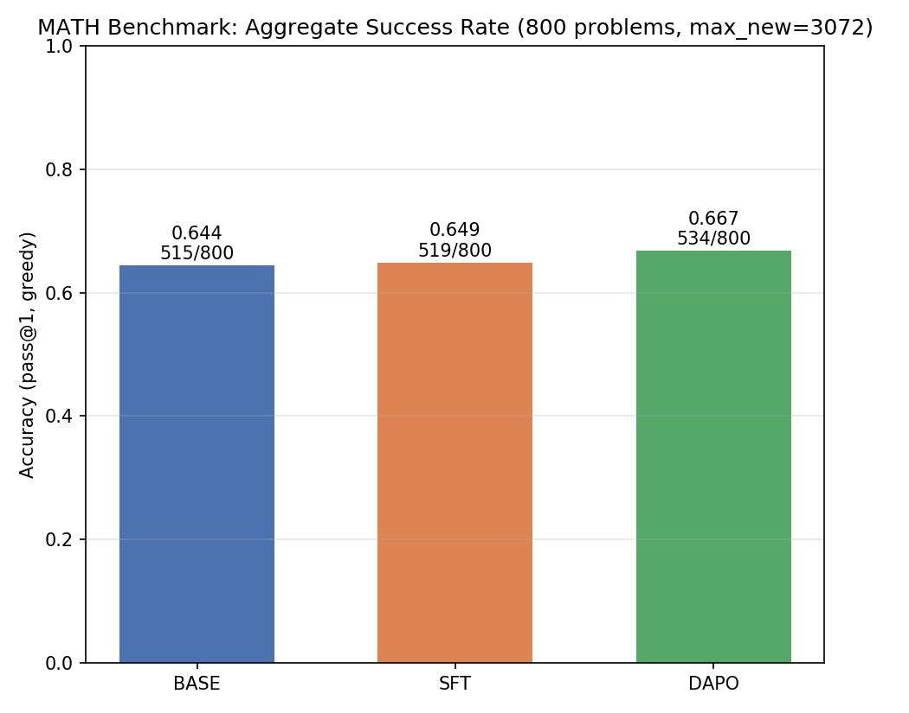
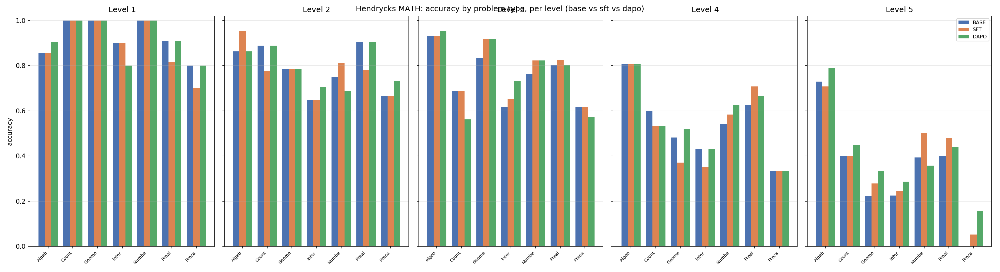

# RL on HRM-Text: Post-Training a Recurrent 1B Model on Competition Math

<p align="center">
  <a href="https://arxiv.org/pdf/2605.20613"></a>
  <a href="https://huggingface.co/sapientinc/HRM-Text-1B"></a>
</p>

**A from-scratch SFT → DAPO (RLVR) post-training pipeline for [HRM-Text-1B](https://huggingface.co/sapientinc/HRM-Text-1B) — a 1B-parameter *recurrent, PrefixLM* language model — built to hill-climb the MATH benchmark and to measure exactly where reinforcement learning helps a small reasoning model, and why it hits a ceiling.**

> This repository is a research fork of Sapient's HRM-Text pretraining code. The upstream code trains the base model from scratch; **this fork adds the post-training stack** (`sft/`, `rl/`, `sft-data/`, `rl-data/`, `evaluation` helpers) and the accompanying results and write-up. The original pretraining documentation is preserved further below.

---

## Overview & Motivation

Most strong math models are enormous and trained on trillions of tokens. HRM-Text-1B is the opposite: **1B parameters, an unusual double-recurrent architecture, ~1000× less pretraining data**, yet it already scores in the 60s on the MATH benchmark. The question this project asks:

> Can we post-train this tiny recurrent model — first to make its output **reliable** (SFT), then with **reinforcement learning from a verifiable reward** (RLVR) — to make it measurably *better* at math? And what does that teach us about RL at 1B scale?

Two engineering deliverables and one scientific result came out of it:

1. **A complete SFT → DAPO post-training pipeline for a recurrent PrefixLM model — written from scratch.** HRM's recurrence and bidirectional-prefix attention break the standard tooling (TRL for SFT, vLLM for rollouts), so both training loops were implemented by hand.
2. **A rigorous, paper-aligned MATH evaluation** with per-level / per-type stratification and multiple robustness probes (leniency, numerics, benchmark-identity).
3. **A clean, evidence-backed picture of *where* and *why* RL helps a small reasoning model — and where it is fundamentally capped** by the pass@1 vs. pass@k headroom that shrinks with scale.

## Results

MATH benchmark, greedy decode (`pass@1`), paper-exact protocol (EleutherAI `hendrycks_math` test set, `synth,cot` prompting, last-`\boxed{}` + Math-Verify scoring, 3072 max new tokens):

| Model | MATH pass@1 (800-problem eval) | boxed-rate |
| --- | ---: | ---: |
| **Base** (HRM-Text-1B) | 64.4% (515/800) | 0.94 |
| **+ SFT** (LoRA, 1 epoch) | 64.9% (519/800) | 0.94 |
| **+ DAPO** (RLVR) | **66.7% (534/800)** | ~0.95 |

*Base model on the full 5,000-problem test set: **63.5%** (3174/5000). All three models above are compared on the same held-out 800-problem sample under an identical engine and protocol, so the deltas are valid.*



**Base accuracy by MATH level:** L1 89% · L2 79% · L3 75% · L4 60% · L5 38%.



### The finding: SFT buys reliability, RL sharpens — it does not teach

- **SFT raised accuracy essentially not at all (63.5% → ~64%), and that is the correct outcome.** The base model already *knows* the math; what it lacked was a consistent, gradable output format. SFT locked in "always end with `\boxed{answer}`," pushing the boxed-rate on RL rollouts to ~0.98 so the reward signal becomes trustworthy. Exactly **one** epoch, on purpose: over-training SFT collapses the output diversity that RL depends on.
- **DAPO training was healthy but capped.** On matched-difficulty prompts the reward variance was near-maximal (ideal), entropy stayed stable (no collapse), and dynamic sampling retained the informative groups — yet aggregate reward stayed flat across the training budget.
- **Why RL is weak at 1B — pass@1 vs pass@k.** RLVR does not teach new skills; it sharpens `pass@1` toward `pass@k` and no further. The headroom is `pass@k − pass@1`. For large models that gap is large (a correct trajectory is usually hiding somewhere in the distribution); for a 1B model it is tiny — when it is wrong, it tends to be wrong in *all* samples, so there is nothing to sharpen. This matches the base model paper's own ~0.1-point projected RL gain at this scale. **The contribution here is making that limit concrete and measurable.**

Additional stratified analyses are in [`photos/`](photos/) (`strat_by_type.png`, `strat_heatmap.png`, `strat_counts.png`).

## Background: the HRM-Text-1B Architecture

HRM-Text is **not a standard transformer**. Two design choices dominate the post-training engineering:

### Nested recurrent computation ("depth for free")

Before producing each output token, HRM runs a nested recurrent loop through two weight-tied modules — by default **2 H-cycles × 3 L-steps ≈ 8 effective compute passes** from 1B parameters:

- **H-module (slow / strategic):** high-level context and direction; updates once per H-cycle.
- **L-module (fast / execution):** fine-grained computation; runs multiple times per H-cycle.
- **State injection:** additive coupling `z_L = z_L + z_H` between modules.
- **Weight-tying:** the same H and L weights are reused across every pass — deep effective computation at a small parameter count.

The main architecture lives in [`models/baselines/hrm_nocarry_bp_warmup.py`](models/baselines/hrm_nocarry_bp_warmup.py); recurrent baselines (TRM, RINS, UT, Transformer) are alongside it.

### PrefixLM attention (why standard tooling breaks)

Each example is `{condition, instruction, response}`. **Instruction (prefix) tokens attend bidirectionally** (BERT-style, the model reads the whole problem first); **response tokens attend causally** (GPT-style, generated autoregressively). This is implemented with a custom two-pass FlashAttention-3 kernel ([`models/flash_attention_prefixlm_v2.py`](models/flash_attention_prefixlm_v2.py)).

- During training the kernel is driven by `prefix_lens` / `causal_lens` / `cu_seqlens` metadata.
- At inference/HF-API time it is driven by **`token_type_ids`** (`1` = bidirectional prefix, `0` = causal response). Omitting them silently applies pure-causal attention — the wrong distribution.

**Consequences that shaped this project:**
- **TRL `SFTTrainer` cannot be used** — it is causal-only and cannot pass `token_type_ids`, so it would corrupt the prefix attention pattern on every gradient step. We wrote our own SFT loop.
- **vLLM cannot be used for rollouts** — PagedAttention assumes causal attention everywhere; HRM's model card lists vLLM support as "in progress." We generate rollouts with HuggingFace `model.generate(..., token_type_ids=...)`.

### Condition flags

Special tokens prepended to the instruction (present throughout pretraining) that condition output style: `cot` (step-by-step reasoning), `synth` (synthetic-style response), `direct` (short answer), `noisy` (web formatting). This project uses **`cot,synth`** everywhere — SFT, RL rollouts, and eval — matching the base model card and the paper's eval config.

## Method

### Stage 1 — SFT (LoRA, format reliability)

[`sft/train_hrm_sft.py`](sft/train_hrm_sft.py) — HuggingFace model + PEFT LoRA, custom training loop.

- **Goal:** teach one habit — always finish with `\boxed{answer}` — so the RL grader can find an answer. Not to teach math.
- **LoRA:** rank 16, alpha 16, dropout 0.05, targets `q/k/v/o_proj` + `gate/up/down_proj` in both H- and L-modules (~16.5M params, ~1.4% of the model). Embeddings, LM head, and the recurrent state-injection weights are deliberately left frozen.
- **Loss:** NLL on **response tokens only** (`labels = -100` over the prefix); `token_type_ids` mark prefix vs. response.
- **Hyperparameters:** 1 epoch, lr 2e-5, cosine schedule, grad-clip 1.0, gradient checkpointing, token-count length-grouped batching, `max_len` 4096.
- **Preemption-safe:** adapter + optimizer + scheduler + step + RNG saved every N steps and on a time budget, with a clean exit code for SLURM self-resubmit.

**Data** ([`sft-data/prepare_sft_dataset.py`](sft-data/prepare_sft_dataset.py)): 20K examples sampled from `open-r1/OpenR1-Math-220k` (plus MATH train), reformatted to HRM's `{condition, instruction, response}` with `cot,synth`, response = full CoT solution ending in `\boxed{answer}`. A **hard assertion enforces 100% `\boxed{}` coverage** before saving — the check that caught the silent data-corruption bug (see below).

### Stage 2 — DAPO (RLVR)

[`rl/train_dapo.py`](rl/train_dapo.py) — decoupled-clip GRPO, custom loop with HF-generate rollouts. DAPO = GRPO + two upgrades that combat the dominant 1B-scale failure mode, **entropy collapse**.

Per step:
1. Sample `prompts_per_step` (16) unique prompts; generate `group` (8) rollouts each with `token_type_ids=1` on the prompt (PrefixLM), via HF `generate` — **not vLLM**.
2. Reward each rollout with Math-Verify on the **last** `\boxed{}` vs. gold → `r ∈ {0, 1}`.
3. **Dynamic sampling:** drop zero-variance groups (all-right / all-wrong teach nothing); resample until enough non-degenerate groups are collected.
4. **Group-relative advantage** `A_i = (r_i − mean_g) / (std_g + eps)`, broadcast to the rollout's response tokens.
5. DAPO surrogate with **asymmetric clip** (`eps_low=0.20`, `eps_high=0.28` — "clip-higher" gives exploratory tokens room to grow), **`beta_kl=0`** (no KL penalty — long-CoT math RL benefits from diverging from pretraining, so no reference model is needed), token-level mean over response tokens, `ppo_epochs=2`.

Init: the SFT LoRA is **merged into the frozen base**, and a **fresh LoRA** trains under DAPO. Reference DAPO config: lr 5e-6, group 8, prompts/step 16, min-kept-groups 6, max-new-tokens 3072, temperature 1.0, grad-clip 1.0, LoRA r16. Rich per-step metrics (`reward_mean/std`, `boxed_rate`, `trunc_rate`, `kept_groups`, `entropy`, `gnorm`) are streamed to `metrics.jsonl` for the health monitoring described above.

**Prompt pool** ([`rl-data/prepare_dapo_prompts.py`](rl-data/prepare_dapo_prompts.py)): built from `BytedTsinghua-SIA/DAPO-Math-17k` and OpenR1, plus **hendrycks Level 3–5 slices** (`rl-data/hendrycks_l34_dapo.jsonl`, `hendrycks_l35_dapo.jsonl`). Difficulty is chosen deliberately: L1–2 are always solved (no gradient), L5+ almost never (no gradient); the learning signal lives in the mixed-outcome middle band.

### Reward function

[`rl/reward.py`](rl/reward.py):
- `extract_last_boxed` — brace-matched extraction of the **last** `\boxed{}` (DeepSeek-style traces leave intermediate self-correction boxes; only the final one is the answer). Tolerates a truncated closing brace.
- `is_correct` — `math_verify.parse` + `verify` for **symbolic** equivalence, so `1/2`, `0.5`, and `\frac{1}{2}` all score correct where string match would fail on the majority of level-4/5 equivalent forms.
- Reward = 1.0 correct / 0.0 otherwise (optional format bonus supported).

### Evaluation

- [`rl/eval_math.py`](rl/eval_math.py) — paper-aligned MATH eval (full hendrycks test, all 7 subjects, `synth,cot`, greedy, last-`\boxed{}` + Math-Verify), with per-level, per-type, and per-(type×level) breakdowns and sharding; works on base or any LoRA adapter.
- [`rl/eval_rollouts.py`](rl/eval_rollouts.py) — rollout-health probe over the exact DAPO generation path: `boxed_rate`, `truncation_rate`, `solve_rate`, `pass@G`, `nondegen_rate`, `mean_gen_len` — used to confirm SFT format reliability and validate prompt-pool difficulty.
- [`rl/eval_math500.py`](rl/eval_math500.py) — MATH-500 eval (kept for comparison; documented as a harder curated subset — see the benchmark-identity trap below).
- Robustness probes: [`rl/eval_leniency.py`](rl/eval_leniency.py) (Math-Verify symbolic vs. exact string match), [`rl/eval_numerics.py`](rl/eval_numerics.py) (dtype/attention-impl sensitivity of greedy decode).
- [`rl/gen_demo.py`](rl/gen_demo.py) — cached base/SFT/DAPO side-by-side outputs for the presentation.

## Notable Engineering Problems Solved

RL on a brand-new architecture is finicky; the honest failure/lessons reel:

- **Silent data corruption.** A JSON-escaping bug had wiped valid `\boxed{}` answers from **17,592 of 20,000** SFT rows — enough to zero out *every* RL reward. Caught only by the mandatory 100%-boxed assertion in the data prep. This single class of bug had zeroed a *prior* experiment's rewards entirely.
- **Prompt difficulty selection.** First RL prompts were competition/AIME-level and too hard → reward stuck at ~0.11 with ~44% useful groups. Matched-difficulty (L3–5) prompts → reward ~0.45 with ~75% useful groups — roughly **4× the learning signal**.
- **No fast inference engine for recurrent models.** vLLM is incompatible with PrefixLM, so rollouts run through HF `generate` at ~25 min/RL step — the true bottleneck that capped the number of RL steps. (A vLLM port would give 5–10× rollouts and is the obvious next step.)
- **Preemption on a `ckpt` SLURM partition.** 8–9h preemptible walltime handled with `--requeue`, `USR1` signal trap, a runtime-budget checkpoint-before-kill, and a self-resubmit sbatch chain that survives non-zero preemption exit codes ([`rl/submit_dapo.sbatch`](rl/submit_dapo.sbatch), [`sft/submit_sft.sbatch`](sft/submit_sft.sbatch)).
- **Benchmark-identity trap.** An initial eval on curated MATH-500 read 48% and looked like a regression; the paper's full hendrycks MATH test read 63.5%. Lesson baked into the eval code: "MATH" is not one dataset.
- **Base-vs-paper gap investigation (63.5% vs. paper's 56.2%).** Ruled out sampling noise (full 5000), numerics (~1%), and data contamination (0/1.5M rows); traced the residual to native-engine vs. the HF-integration generation path (HF support was merged after the paper). Because base/SFT/DAPO all use the same engine, the reported deltas remain valid.

## Tech Stack

- **Base model:** `sapientinc/HRM-Text-1B` (1.18B params) — recurrent H/L modules, PrefixLM, FlashAttention-3.
- **RL/SFT:** **custom training loops** (no TRL, no veRL, no vLLM — all incompatible with the architecture) built on **PyTorch**, **HuggingFace Transformers**, and **PEFT** (LoRA).
- **Reward / verifier:** `math-verify` (sympy-based symbolic equivalence).
- **Data:** HuggingFace `datasets` (OpenR1-Math-220k, DAPO-Math-17k, hendrycks MATH, MATH-500).
- **Infra:** single **H200** (141 GB) per job; SLURM `gpu-h200` preemptible `ckpt` partition on the UW Hyak Klone cluster; W&B / JSONL metrics logging.
- **Pretraining stack (upstream):** PyTorch FSDP2, Hydra configs, multipack sequence packing.

## Setup

The post-training scripts run on a single Hopper GPU (H100/H200). FlashAttention-3 is required by the model's attention path.

```bash
pip install -r requirements.txt
# FlashAttention 3 is NOT `pip install flash-attn` (that is FA2). Build from source
# (flash-attention repo `hopper/` dir) or `pip install --pre flash-attn-4`.
# Requires H100/H200, CUDA >= 12.3, ninja.
```

## Usage

**1. Prepare data**

```bash
python sft-data/prepare_sft_dataset.py            # OpenR1 -> {condition,instruction,response}, asserts 100% boxed
python rl-data/prepare_dapo_prompts.py --out rl-data/dapo_prompts.jsonl
```

**2. SFT (LoRA)**

```bash
python sft/train_hrm_sft.py \
  --data sft-data/sft_20k_synthcot.jsonl \
  --out runs/sft --epochs 1 --lr 2e-5 --lora-r 16
# or submit the preemption-safe SLURM job: sbatch sft/submit_sft.sbatch
```

**3. DAPO (RLVR)**

```bash
python rl/train_dapo.py \
  --sft-adapter runs/sft/final_adapter \
  --prompts rl-data/hendrycks_l35_dapo.jsonl \
  --out runs/dapo --total-steps 80 \
  --prompts-per-step 16 --group 8 --max-new-tokens 3072 \
  --lr 5e-6 --eps-low 0.20 --eps-high 0.28
# or the self-resubmitting SLURM chain: sbatch rl/submit_dapo.sbatch
```

**4. Evaluate**

```bash
# Base model
python rl/eval_math.py --dataset hendrycks --condition synth,cot --tag base
# With an SFT or DAPO adapter
python rl/eval_math.py --adapter runs/dapo/final_adapter --tag dapo
# Rollout health check
python rl/eval_rollouts.py --adapter runs/sft/final_adapter --prompts rl-data/hendrycks_l35_dapo.jsonl
```

## Project Structure

```text
RL-on-HRM-Text/
|-- sft/                       # SFT: custom HF+PEFT LoRA loop + SLURM launcher
|   |-- train_hrm_sft.py
|   `-- submit_sft.sbatch
|-- sft-data/                  # SFT dataset prep, JSONL data, tokenized shards
|-- rl/                        # DAPO trainer, reward/verifier, evals, demo gen
|   |-- train_dapo.py          #   decoupled-clip GRPO (RLVR)
|   |-- reward.py              #   last-\boxed{} extraction + Math-Verify
|   |-- eval_math.py           #   paper-aligned MATH eval (stratified)
|   |-- eval_rollouts.py       #   rollout-health probe
|   |-- eval_math500.py / eval_leniency.py / eval_numerics.py
|   `-- submit_dapo.sbatch     #   preemption-safe self-resubmit chain
|-- rl-data/                   # DAPO prompt pools (DAPO-17k, OpenR1, hendrycks L3-5)
|-- photos/                    # result figures (aggregate + stratified analyses)
|-- presentation/SLIDES.txt    # 12-min talk script + numbers cheat-sheet
|-- HRM-Text-1B-Pipeline-Overview.md      # full design-decision write-up
|-- HRM-Text-1B-Complete-Pipeline.md      # complete implementation doc
|-- models/ config/ evaluation/ conversion/ pretrain.py  # upstream pretraining stack
`-- requirements.txt
```

Design rationale, RL-method comparisons (why DAPO over PPO/DPO/RAFT/vanilla GRPO), and the full parameter cheat-sheet are in [`HRM-Text-1B-Pipeline-Overview.md`](HRM-Text-1B-Pipeline-Overview.md).

## References

- **HRM-Text (base model):** Guan Wang, Changling Liu, Chenyu Wang, Cai Zhou, Yuhao Sun, Yifei Wu, Shuai Zhen, Luca Scimeca, Yasin Abbasi Yadkori. *HRM-Text: Efficient Pretraining Beyond Scaling.* arXiv:2605.20613, 2026. — Sapient Inc. / Sapient Labs (Hierarchical Reasoning Model).
- **DAPO:** *DAPO: An Open-Source LLM Reinforcement Learning System at Scale.* arXiv:2503.14476.
- **pass@k ceiling for RLVR:** Yue et al., 2025 — RLVR raises pass@1 while leaving pass@k ≈ base.

```bibtex
@misc{wang2026hrmtextefficientpretrainingscaling,
      title={HRM-Text: Efficient Pretraining Beyond Scaling},
      author={Guan Wang and Changling Liu and Chenyu Wang and Cai Zhou and Yuhao Sun and Yifei Wu and Shuai Zhen and Luca Scimeca and Yasin Abbasi Yadkori},
      year={2026},
      eprint={2605.20613},
      archivePrefix={arXiv},
      primaryClass={cs.CL},
      url={https://arxiv.org/abs/2605.20613},
}
```

## License

Apache License 2.0 (inherited from the upstream HRM-Text project).

---

<details>
<summary><strong>Upstream: HRM-Text pretraining framework (from scratch)</strong></summary>

HRM-Text is a 1B text generation model based on the HRM architecture. It offers a full pretraining framework — hierarchical recurrent architecture, PrefixLM sequence packing, FlashAttention-3 kernels, PyTorch FSDP2 training, evaluation, and checkpoint conversion — making foundation-model pretraining accessible with far less compute and data.

**Reference pretraining results:**

| Size | GPUs | Time | GSM8k | MATH | DROP | MMLU | ARC-C | HellaSwag | Winogrande | BoolQ |
| --- | ---: | ---: | ---: | ---: | ---: | ---: | ---: | ---: | ---: | ---: |
| **L (0.6B)** | 8 | 50 hrs | 77.6% | 51.2% | 78.6% | 56.6% | 75.9% | 52.7% | 67.6% | 85.0% |
| **XL (1B)** | 16 | 46 hrs | 84.7% | 56.5% | 82.3% | 60.7% | 81.9% | 63.4% | 72.4% | 86.2% |

Pretraining data is produced by the companion [`data_io`](https://github.com/sapientinc/data_io) pipeline (clean, tokenize, stratified-sample). Launch pretraining with `torchrun --nproc_per_node=8 pretrain.py arch/size@arch=L ...`; evaluate with `python -m evaluation.main ckpt_path=...`; export with `python -m conversion.convert_to_hf`. Native SFT is also supported via `pretrain.py --config-name cfg_sft`.

Model configs live under [`config/arch/net`](config/arch/net) (`hrm`, `transformer`, `trm`, `rins`, `ut`) and sizes under [`config/arch/size`](config/arch/size) (`B`/`L`/`XL`/`XXL`/`XXL_wide`). See the git history and `HRM-Text-1B-*.md` docs for full detail. Join the HRM community: [https://discord.gg/sapient](https://discord.gg/sapient).

</details>
